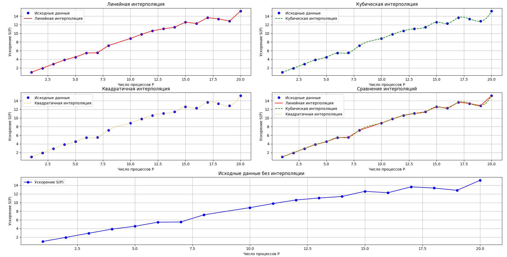

# Parallel solving Ax=b
<a href="prac/test.c"><button>Source Code</button></a>

> - [Task](#task-solving-the-linear-system) 
>   - [Description](#description) 
>   - [Jacobi Method](#jacobi-method)
> - [CLI](#cli)
>   - [Generator](#system-generation)
>   - [Run](#program-run)
> - [Graph](#graph)
### Task: Solving the Linear System $ Ax = b $
#### Description
A parallel program should be developed using MPI to solve the system of linear algebraic equations (SLAE):

$$Ax = b$$


where $ A $ is a square matrix of size $ n \times n $, $ x $ is the vector of unknowns, and $ b $ is the vector of right-hand side values.

The solution should be obtained using the Jacobi method, which is iterative. The accuracy of the solution is defined by the parameter $ \epsilon $, which specifies the acceptable error. The elements of matrix $ A $ and vector $ b $ should be read from files, where the matrix size $ A $ is $ n \times n $, and the vector $ b $ has size $ n $. The matrix size $ n $ should be passed as a parameter in the command line.

#### Requirements:
1. **MPI Implementation**: The program must use MPI for parallel execution across multiple processes.
2. **Data Distribution**: The elements of matrix $ A $ should be distributed across processes in a banded fashion, with each process handling $ n/p $ rows, where $ p $ is the number of processes.
3. **Data Input**: The size of matrix $ A $ and vector $ b $ is determined from the file $ A.dat $, which should be provided to the program. All data should be read correctly and distributed among the processes.
4. **Solution Accuracy**: The solution must achieve the specified accuracy $ \epsilon $, and the program should stop when the difference between iterations is smaller than the given precision.
5. **Command Line Parameters**:
   - Accuracy $ \epsilon $
   - Filenames for matrix $ A $ and vector $ b $
   - Matrix size $ n $ (passed as a parameter in the command line)
6. **Performance Measurement**: A graph of the program’s speedup should be generated based on the number of processes, using the specified value of $ \epsilon $.

#### Jacobi Method
The Jacobi method is an iterative technique for solving systems of linear equations. The formula used is:

$$
x_i^{(k+1)} = \frac{1}{A_{ii}} \left( b_i - \sum_{j \neq i} A_{ij} x_j^{(k)} \right)
$$

where $ x_i^{(k+1)} $ is the updated value of the $ i $-th element of the vector $ x $ at the $ k+1 $-th iteration, $ A_{ij} $ are the elements of matrix $ A $, and $ b_i $ are the elements of vector $ b $.

#### Expected Output:
- The source code for solving the SLAE using the Jacobi method with MPI.
- Matrix $ A $ and vector $ b $ used in the program.
- A graph showing the speedup of the program as a function of the number of processes $ p $, illustrating the performance improvement with increasing process count.

Further details on the method and algorithm can be found in external resources, such as [bigor.bmstu.ru](http://bigor.bmstu.ru/?cnt/?doc=Parallel/ch030203.mod).

---

## CLI
### System generation

For the system generation, use <a href="prac/generator.py"><button>generator.py</button></a>

- CLI Interface:
```bash
usage: generator.py [-h] -n N [-m {auto,manual}] [--x X] [-A A] [-b B] [-p]

Generation of matrix A and vector b for solving Ax = b by vector x

options:
  -h, --help        show this help message and exit
  -n N              System dimension (n)
  -m {auto,manual}  Method of generating vector x (auto/manual)
  --x X             Vector x as a comma-separated list (only for manual)      
  -A A              Name of the file for matrix A (default A.bat)
  -b B              Name of the file for vector b (default b.bat)
  -p                Flag to print result to the screen
```

---
### Program run
Run the program using the following command:

```bash
mpixlc -o "$program" "$source"
mpisubmit.pl -p "$num_proc" ./"$program" -- N="$N" eps="$eps" A="$A" b="$b"
```
or using script <a href="prac/run.sh"><button>run.sh</button></a>
```bash
usage: script.sh [-h] -p NUM_PROC -N N -eps EPS -A A -b B -source SOURCE -program PROGRAM

Options:
  -h, --help        Show this help message and exit
  -p NUM_PROC       Number of processes (required)
  -N N              System dimension (required)
  -eps EPS          Precision for calculations (required)
  -A A              Name of the file for matrix A (required)
  -b B              Name of the file for vector b (required)
  -source SOURCE    Path to the source code for compilation (required)
  -program PROGRAM  Name of the compiled program (required)
```

Result will be in the file `result.dat`, and in file `times.dat`
it will be the time spent on calculations and the number of processes.

> [!NOTE]
> Do not forget to connect SpectrumMPI 
> ```bash
> module load SpectrumMPI
> ```

---
### Graph
A graph showing the acceleration of the program as a function of the number of processes $ p $, with the calculation time not including the time spent on reading data from a file and writing the result to a file.



$$
A: \mathbb{R}^{1500} \to \mathbb{R}^{1500}, \quad A x = b \newline \ \ \ 
A \in \mathbb{R}^{1500 \times 1500}, \quad x \in \mathbb{R}^{1500}, \quad b \in \mathbb{R}^{1500}
$$

